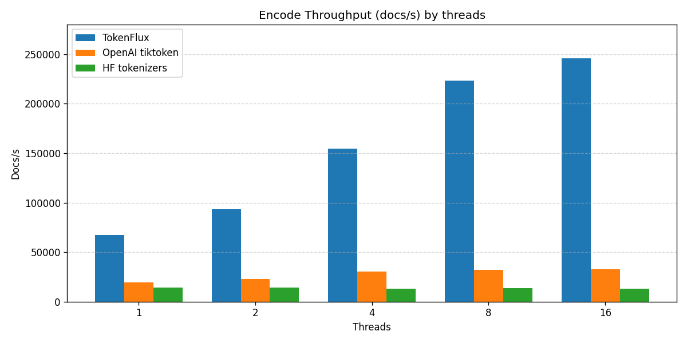

# TokenFlux++

`TokenFlux++` is a fast tokenizer toolkit (C++ core + Python bindings) for:

- Training tokenizer models (`byte_bpe`, `bpe`, `wordpiece`, `unigram`)
- High-throughput encoding and dataset pre-tokenization

Latest release: **0.3.3**  
Releases: https://github.com/TabNahida/TokenFluxPlusPlus/releases

## Install

From PyPI:

```bash
pip install tokenflux
```

From source (local repo):

```bash
pip install .
```

Editable source install:

```bash
pip install -e .
```

If no prebuilt wheel is available for your platform, installation falls back to source build and requires `xmake` + a C++ toolchain.

## Quickstart (Python)

```python
import tokenflux as tf

# train
cfg = tf.TrainConfig()
cfg.trainer = tf.TrainerKind.byte_bpe
cfg.vocab_size = 16000
cfg.output_json = "tokenizer.json"
cfg.output_vocab = "vocab.json"
cfg.output_merges = "merges.txt"
tf.train(cfg, ["data/train.jsonl"])

# encode
tok = tf.Tokenizer("tokenizer.json")
ids = tok.encode("hello TokenFlux++")
print(ids[:10], len(ids))
```

## API Docs

- C++ API: [docs/cpp_api.md](docs/cpp_api.md)
- Python API: [docs/python_api.md](docs/python_api.md)

## Performance

```bash
python benchmarks/tokenfluxpp_vs_tiktoken_vs_tokenizer.py
```

Install compare dependencies:

```bash
python -m pip install tiktoken
python -m pip install tokenizers
```

Snapshot — encode throughput (docs/s) by thread count (higher is better):




Latest encode latency speedup:
- **4.32x** vs OpenAI tiktoken
- **11.89x** vs HuggingFace tokenizers

Full benchmark report:  
[benchmarks/BENCHMARK_RESULTS_2026-03-01.md](benchmarks/BENCHMARK_RESULTS_2026-03-01.md)

## CLI

Train:

```bash
xmake run TokenFluxTrain \
  --data-list "data/inputs.list" \
  --trainer byte_bpe \
  --vocab-size 16000 \
  --threads 8 \
  --output tokenizer.json \
  --vocab vocab.json
```

Tokenize:

```bash
xmake run TokenFluxTokenize \
  --data-list "data/inputs.list" \
  --tokenizer tokenizer.json \
  --out-dir data/tokens \
  --add-eos \
  --threads 8 \
  --max-tokens-per-shard 50000000
```

Tokenization output is a concatenated document stream in shard files.  
`--add-eos` is enabled by default; use `--no-eos` to disable automatic EOS append per document.

## Build

```bash
xmake
```

Python extension output is typically under `build/.../tokenflux_cpp.pyd` (Windows) or `build/.../tokenflux_cpp.so` (Linux/macOS).

## Notes

- To pick up binding updates (for example encode threading changes), rebuild:

```bash
xmake f -y -m release --pybind=y
xmake build -y tokenflux_cpp
```

- `.env` defaults are supported for CLI workflows.
